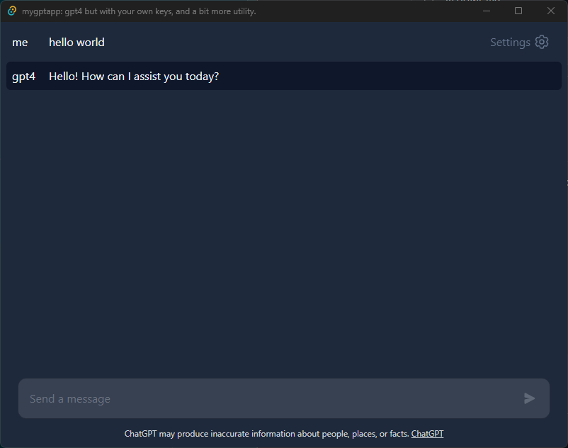

# mygptapp

A simple desktop app for chatgpt which uses your own api key and has no other dependencies.



Dependencies:
- nodejs & npm
- tailwindcss
- rust

Installation:
- git clone this repo
```bash
$ cargo tauri dev
```